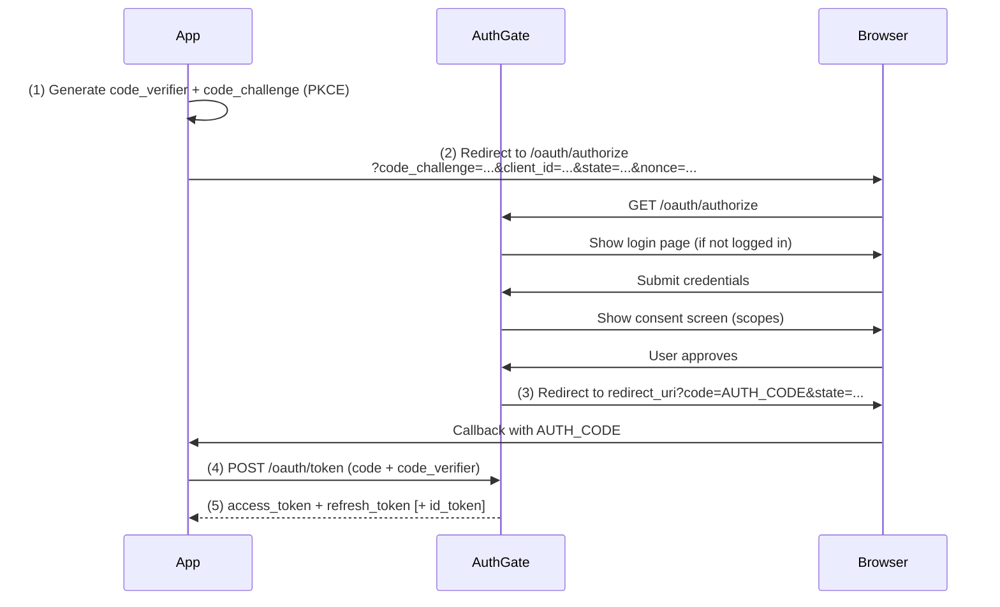

# Authorization Code Flow + PKCE

The **Authorization Code Flow** (RFC 6749) with **PKCE** (Proof Key for Code Exchange, RFC 7636) is the recommended OAuth 2.0 flow for web applications, single-page apps (SPAs), and mobile apps.

## When to Use This Flow

Use Authorization Code + PKCE when:

- You are building a **server-rendered web app** (confidential client — has a backend that can hold `client_secret`)
- You are building a **single-page app** (public client — no secret)
- You are building a **mobile or desktop app** (public client)
- You need users to see a **consent screen** before granting access

## Client Types

| Type             | Credentials                | Typical examples                    | Must use PKCE?        |
| ---------------- | -------------------------- | ----------------------------------- | --------------------- |
| `confidential`   | `client_id` + `client_secret` | Rails / Django / Node backend    | Recommended           |
| `public`         | `client_id` only (no secret)  | React SPA, iOS/Android, Electron | Yes — always          |

> PKCE (S256) is **always safe to use** and is the only `code_challenge_method` AuthGate accepts. Confidential clients should also include it — defence-in-depth.

## How It Works



### Step 1: Generate PKCE Parameters

Generate a cryptographically random `code_verifier` (43–128 chars) and derive the `code_challenge`:

**Go**

```go
import (
    "crypto/rand"
    "crypto/sha256"
    "encoding/base64"
)

buf := make([]byte, 32)
_, _ = rand.Read(buf)
codeVerifier := base64.RawURLEncoding.EncodeToString(buf)

h := sha256.Sum256([]byte(codeVerifier))
codeChallenge := base64.RawURLEncoding.EncodeToString(h[:])
```

**Python**

```python
import hashlib, base64, secrets

code_verifier = base64.urlsafe_b64encode(secrets.token_bytes(32)).rstrip(b"=").decode()
digest = hashlib.sha256(code_verifier.encode()).digest()
code_challenge = base64.urlsafe_b64encode(digest).rstrip(b"=").decode()
```

**JavaScript (Node / Browser via `crypto.subtle`)**

```javascript
// Node 16+:
const codeVerifier = crypto.randomBytes(32).toString("base64url");
const codeChallenge = crypto.createHash("sha256").update(codeVerifier).digest("base64url");
```

Store the `code_verifier` for use in Step 4:

- **Confidential clients**: server-side session.
- **SPAs**: prefer an in-memory variable. Only fall back to `sessionStorage` if you must survive a reload — note that any browser storage is reachable from XSS, and the real mitigation is a Backend-For-Frontend (BFF) pattern.

### Step 2: Redirect to Authorization Endpoint

```
GET /oauth/authorize
  ?client_id=YOUR_CLIENT_ID
  &redirect_uri=https://yourapp.example/callback
  &response_type=code
  &scope=openid profile email offline_access
  &state=RANDOM_STATE
  &nonce=RANDOM_NONCE
  &code_challenge=CODE_CHALLENGE
  &code_challenge_method=S256
```

| Parameter               | Required    | Notes                                                      |
| ----------------------- | ----------- | ---------------------------------------------------------- |
| `client_id`             | yes         | From the admin                                             |
| `redirect_uri`          | yes         | **Exact string match** against a registered URI            |
| `response_type`         | yes         | Must be `code` (the only type AuthGate supports)           |
| `scope`                 | recommended | Space-separated; include `openid` for an ID token          |
| `state`                 | yes (CSRF)  | Random value — validate on callback                        |
| `nonce`                 | OIDC        | Required when `scope` contains `openid`; ends up in `id_token` for replay protection |
| `code_challenge`        | PKCE        | Derived as above                                           |
| `code_challenge_method` | PKCE        | Must be `S256` (`plain` is rejected)                       |

> **State & nonce**: generate independently, random, and long enough (≥ 16 bytes base64url). Persist `state` and `code_verifier` against the user session keyed by `state`, so the callback can look them up.

The user will be prompted to log in (if not already) and then see a consent screen listing requested scopes.

### Step 3: Handle the Callback

```
https://yourapp.example/callback?code=AUTH_CODE&state=RANDOM_STATE
```

Before using `code`, **verify `state` matches** what you sent. If it doesn't, abort.

If the user denied consent, AuthGate redirects with an OAuth error instead:

```
https://yourapp.example/callback?error=access_denied&error_description=...&state=RANDOM_STATE
```

See [Errors](./errors) for the full list.

### Step 4: Exchange Code for Tokens

The `/oauth/token` endpoint accepts **only** `application/x-www-form-urlencoded` — not JSON.

**Public client (PKCE only):**

```bash
curl -X POST https://your-authgate/oauth/token \
  -H "Content-Type: application/x-www-form-urlencoded" \
  -d "grant_type=authorization_code" \
  -d "code=AUTH_CODE" \
  -d "redirect_uri=https://yourapp.example/callback" \
  -d "client_id=YOUR_CLIENT_ID" \
  -d "code_verifier=CODE_VERIFIER"
```

**Confidential client (HTTP Basic — recommended):**

```bash
curl -X POST https://your-authgate/oauth/token \
  -u "$CLIENT_ID:$CLIENT_SECRET" \
  -H "Content-Type: application/x-www-form-urlencoded" \
  -d "grant_type=authorization_code" \
  -d "code=AUTH_CODE" \
  -d "redirect_uri=https://yourapp.example/callback" \
  -d "code_verifier=CODE_VERIFIER"
```

Or put the credentials in the form body (`client_id=...&client_secret=...`). HTTP Basic is preferred per RFC 6749 §2.3.1.

**Response:**

```json
{
  "access_token": "eyJhbG...",
  "refresh_token": "def502...",
  "id_token": "eyJhbG...",
  "token_type": "Bearer",
  "expires_in": 3600,
  "scope": "openid profile email offline_access"
}
```

`id_token` is only present when `openid` was in the requested `scope`. See [OpenID Connect](./oidc) for its claims and how to verify it.

> The same `redirect_uri` you sent in Step 2 must be sent again here — AuthGate compares them exactly.

### Step 5: Refresh the Access Token

When the access token nears expiry, trade the refresh token for a new pair. See [Tokens & Revocation §Refreshing Tokens](./tokens#refreshing-tokens) — pay special attention to the [rotation-mode reuse-detection gotcha](./tokens#rotation-mode-the-reuse-detection-gotcha), which revokes the entire token family if an old refresh token is used twice.

### Step 6: Sign Out

On logout, **revoke the refresh token** (not just the local session) — see [Tokens & Revocation §Sign Out](./tokens#sign-out--oauthrevoke-rfc-7009). Dropping the cookie alone leaves a stolen token valid until it expires.

## Managing User Authorizations

Users can review and revoke per-app access at **Account → Authorized Apps** in the AuthGate UI. Expect to see a user return to your app with an expired/revoked token — handle `invalid_grant` and restart the flow.

## Security Checklist

| Requirement               | Details                                                                   |
| ------------------------- | ------------------------------------------------------------------------- |
| Always validate `state`   | Prevents CSRF on the callback                                             |
| Always validate `nonce`   | For OIDC — compare the `id_token` `nonce` claim to what you sent          |
| Always use PKCE (S256)    | Defence-in-depth even for confidential clients                            |
| Use HTTPS everywhere      | Tokens and codes must never cross the wire in cleartext                   |
| Exact redirect URI        | AuthGate does exact-string match — watch for trailing slashes             |
| Revoke on logout          | Call `/oauth/revoke` with the refresh token                               |
| Short-lived access tokens | Honor `expires_in`; refresh proactively (e.g. 30s before expiry)          |
| Validate `id_token`       | Signature, `iss`, `aud=client_id`, `exp`, `nonce` — see [OpenID Connect](./oidc) |
| SPA token storage         | Prefer BFF. Otherwise: access token in memory only; refresh token in `HttpOnly; Secure; SameSite=Lax` cookie. **Never `localStorage`.** |
| Native / CLI storage      | OS keychain / Credential Manager / Secret Service — see [Device Flow §Storing Tokens Locally](./device-flow#storing-tokens-locally) |

## Example Clients

- [github.com/go-authgate/oauth-cli](https://github.com/go-authgate/oauth-cli) — Auth Code + PKCE in Go
- [github.com/go-authgate/cli](https://github.com/go-authgate/cli) — Hybrid CLI (Device Flow over SSH, Auth Code locally)

## Related

- [Getting Started](./getting-started)
- [Device Authorization Flow](./device-flow)
- [Client Credentials Flow](./client-credentials)
- [OpenID Connect](./oidc)
- [JWT Verification](./jwt-verification)
- [Tokens & Revocation](./tokens)
- [Errors](./errors)
