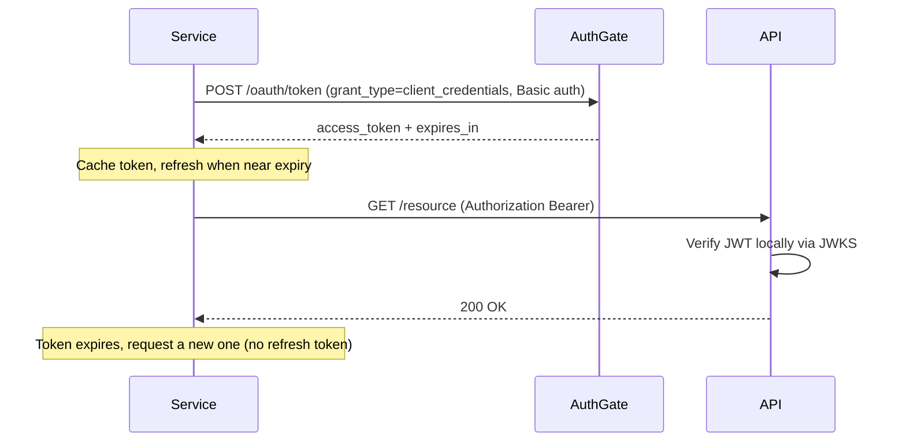

# Client Credentials Flow

The **Client Credentials Grant** (RFC 6749 §4.4) is for machine-to-machine (M2M) authentication. No user is involved — the service authenticates as itself with a `client_id` and `client_secret`.

## When to Use This Flow

- A **microservice, daemon, or CI/CD pipeline** calls a protected API
- There is **no user** — pure service identity
- The service can **securely store** a `client_secret` (server-side secrets manager, env vars — **never** a browser, mobile app, or CLI distributed to end users)

## Before You Integrate

Ask your AuthGate administrator to create a `confidential` client with:

- **Client Credentials Flow** enabled
- The specific **scopes** the service needs (custom API scopes defined for your deployment)
- No redirect URIs required

You'll receive:

- `client_id` — safe to log
- `client_secret` — store in a secrets manager; rotate if leaked

> **Restricted scopes**: `openid` and `offline_access` are not valid in this flow and will be rejected with `invalid_scope`. Scopes are mapped to a synthetic service identity, not a user.

## How It Works



### Step 1: Request an Access Token

Authenticate via HTTP Basic Auth (preferred) or form body. Only `application/x-www-form-urlencoded` bodies are accepted.

**HTTP Basic (recommended per RFC 6749 §2.3.1):**

```bash
curl -X POST https://your-authgate/oauth/token \
  -u "$CLIENT_ID:$CLIENT_SECRET" \
  -H "Content-Type: application/x-www-form-urlencoded" \
  -d "grant_type=client_credentials"
```

**Form body:**

```bash
curl -X POST https://your-authgate/oauth/token \
  -H "Content-Type: application/x-www-form-urlencoded" \
  -d "grant_type=client_credentials" \
  -d "client_id=$CLIENT_ID" \
  -d "client_secret=$CLIENT_SECRET"
```

Omit `scope` to receive the full set of scopes registered on your client. Include `scope=...` only when you want to request a **subset** of them.

> The `$CLIENT_SECRET` env-var form above is fine in docs; in production, **never pass a literal secret on the command line** — argv is visible via `ps` and shell history. Pipe from `curl --netrc`, a config file (`-K`), or use a language SDK.

**Response:**

```json
{
  "access_token": "eyJhbG...",
  "token_type": "Bearer",
  "expires_in": 3600,
  "scope": "<scopes granted to this client>"
}
```

> **No refresh token is issued** for this grant type (RFC 6749 §4.4.3). When the access token expires, request a new one. `/oauth/revoke` and `/oauth/tokeninfo` still apply — see [Tokens & Revocation](./tokens).

If you request a scope the client isn't permitted for, AuthGate returns:

```json
{
  "error": "invalid_scope",
  "error_description": "Requested scope exceeds client permissions or contains restricted scopes (openid, offline_access are not permitted)"
}
```

See [Errors](./errors) for the full catalog.

### Step 2: Use the Token

```bash
curl -H "Authorization: Bearer ACCESS_TOKEN" https://api.example.com/resource
```

Resource servers should **verify the JWT locally** using AuthGate's JWKS — see [JWT Verification](./jwt-verification).

**Identifying M2M tokens**: the JWT `sub` (and `user_id`) claim has the form `client:<client_id>` for Client Credentials tokens. Your resource server can branch on this to distinguish service calls from user-delegated calls.

### Step 3: Cache and Renew

Don't fetch a new token on every request. Cache it in memory and refresh only when nearing expiry (subtract a safety margin):

```go
// Go pseudo-code
if time.Now().Add(30 * time.Second).After(expiresAt) {
    accessToken, expiresAt = requestNewToken()
}
```

```python
# Python
if time.time() + 30 >= expires_at:
    access_token, expires_at = request_new_token()
```

Avoid a thundering herd across service replicas: add small random jitter to the 30-second buffer, or use a shared cache (Redis) with a single-flight renewal.

## Security Checklist

| Requirement              | Details                                                                                  |
| ------------------------ | ---------------------------------------------------------------------------------------- |
| Store secrets securely   | Secrets manager or env vars injected at runtime — never commit to source control         |
| Use HTTPS                | The `client_secret` crosses the wire on every token request                              |
| One client per service   | Independent revocation and per-service scope control                                     |
| Request only needed scopes | Principle of least privilege                                                           |
| Rotate on compromise     | Ask the admin to regenerate the secret; update your secrets manager                      |
| Retry with backoff       | `/oauth/token` is rate-limited — see [Tokens & Revocation §Rate Limits](./tokens#rate-limits); handle 429 with `Retry-After` |
| Cache token, don't re-fetch | Respect `expires_in`; only renew when close to expiry                                 |
| Monitor audit logs       | Ask your admin to set up alerts on anomalous `CLIENT_CREDENTIALS_TOKEN_ISSUED` events    |

## Related

- [Getting Started](./getting-started)
- [Authorization Code Flow](./auth-code-flow)
- [Device Authorization Flow](./device-flow)
- [JWT Verification](./jwt-verification)
- [Tokens & Revocation](./tokens)
- [Errors](./errors)
