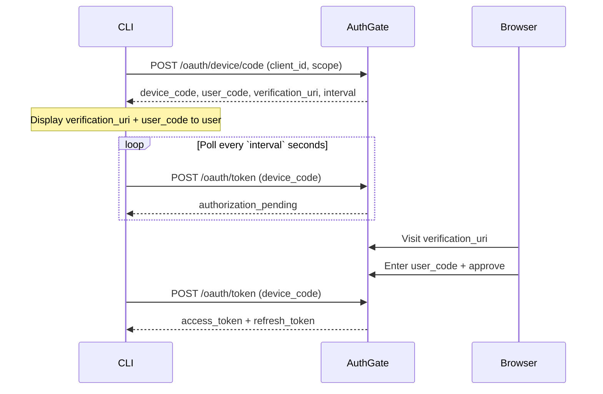

# Device Authorization Flow

The **Device Authorization Grant** (RFC 8628) lets CLI tools, IoT devices, and headless environments authenticate a user without opening a browser on the device itself. The user completes the browser step on any other device (phone, laptop, etc.).

## When to Use This Flow

- You are building a **CLI tool** (`my-tool login`)
- Your environment is **headless** — remote server over SSH, Docker container, CI runner
- Opening a browser programmatically is impossible or inconvenient

The client is always **public** (no `client_secret`). Use `code_challenge` only if you're doing the (rarer) PKCE-for-device variant — AuthGate does not require it here.

## How It Works



### Step 1: Request a Device Code

```bash
curl -X POST https://your-authgate/oauth/device/code \
  -H "Content-Type: application/x-www-form-urlencoded" \
  -d "client_id=YOUR_CLIENT_ID" \
  -d "scope=openid profile email offline_access"
```

| Parameter   | Required | Notes                                                |
| ----------- | -------- | ---------------------------------------------------- |
| `client_id` | yes      | Public client with Device Flow enabled               |
| `scope`     | no       | Space-separated; defaults to `email profile` if omitted. Include `openid` for an ID token |

**Response:**

```json
{
  "device_code": "abc123...",
  "user_code": "WXYZ-1234",
  "verification_uri": "https://your-authgate/device",
  "expires_in": 1800,
  "interval": 5
}
```

> `interval` is the **minimum** poll interval. Respect `slow_down` (see below) to back off further.

### Step 2: Display Instructions to the User

```
To sign in, visit:
    https://your-authgate/device

And enter the code:
    WXYZ-1234

Waiting for authorization…
```

If a browser is available locally, open `verification_uri` automatically (but still print the URL and code in case auto-open fails):

```go
// Go
_ = exec.Command("open", verificationURI).Start()      // macOS
_ = exec.Command("xdg-open", verificationURI).Start()  // Linux
_ = exec.Command("cmd", "/c", "start", verificationURI).Start() // Windows
```

A QR code of `verification_uri` (plus displaying the code) is a friendly touch for mobile users.

### Step 3: Poll for the Token

```bash
curl -X POST https://your-authgate/oauth/token \
  -H "Content-Type: application/x-www-form-urlencoded" \
  -d "grant_type=urn:ietf:params:oauth:grant-type:device_code" \
  -d "device_code=abc123..." \
  -d "client_id=YOUR_CLIENT_ID"
```

**Success** (user approved):

```json
{
  "access_token": "eyJhbG...",
  "refresh_token": "def502...",
  "token_type": "Bearer",
  "expires_in": 3600,
  "scope": "openid profile email offline_access"
}
```

**Errors while polling** (HTTP 400, shape `{"error": "...", "error_description": "..."}`):

| `error`                 | HTTP | Meaning / Action                                            |
| ----------------------- | ---- | ----------------------------------------------------------- |
| `authorization_pending` | 400  | User hasn't approved yet — keep polling at `interval`       |
| `slow_down`             | 400  | Polling too fast — **increase interval by ≥ 5 seconds**     |
| `access_denied`         | 400  | User rejected the request — stop polling                    |
| `expired_token`         | 400  | `device_code` past `expires_in` — restart from Step 1       |
| `invalid_grant`         | 400  | `device_code` unknown or already used — restart from Step 1 |

`429 Too Many Requests` is also possible — see [Tokens & Revocation §Rate Limits](./tokens#rate-limits). The full error catalog lives in [Errors](./errors).

### Step 4: Use the Access Token

```bash
curl -H "Authorization: Bearer ACCESS_TOKEN" https://api.example.com/resource
```

### Step 5: Refresh the Access Token

When the access token nears expiry, trade the refresh token — see [Tokens & Revocation §Refreshing Tokens](./tokens#refreshing-tokens). Read the [rotation-mode reuse-detection gotcha](./tokens#rotation-mode-the-reuse-detection-gotcha) before implementing retries.

### Step 6: Sign Out

On `my-tool logout`, **revoke the refresh token** — deleting the local token file alone leaves a stolen token valid until expiry. See [Tokens & Revocation §Sign Out](./tokens#sign-out--oauthrevoke-rfc-7009).

## Storing Tokens Locally

CLI conventions:

- macOS: **Keychain** (e.g., `security add-generic-password`)
- Linux: **Secret Service** (libsecret) or file in `$XDG_CONFIG_HOME/<app>/token.json` with `0600`
- Windows: **Credential Manager**

Never write refresh tokens to log output or debug traces.

## Integration Checklist

- [ ] `client_id` with Device Flow enabled by the admin
- [ ] Respect `interval` and back off on `slow_down`
- [ ] Restart flow on `expired_token` / `access_denied`
- [ ] Store access & refresh tokens in OS-level secure storage
- [ ] Revoke the refresh token on logout
- [ ] Handle 429 rate-limit responses with backoff

## Example CLI Client

[github.com/go-authgate/device-cli](https://github.com/go-authgate/device-cli) — complete Device Flow in Go.

## Related

- [Getting Started](./getting-started)
- [Authorization Code Flow](./auth-code-flow)
- [Client Credentials Flow](./client-credentials)
- [JWT Verification](./jwt-verification)
- [Tokens & Revocation](./tokens)
- [Errors](./errors)
